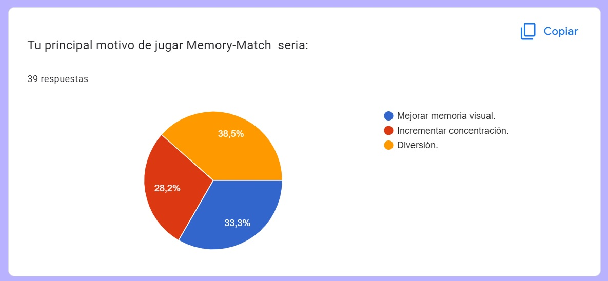
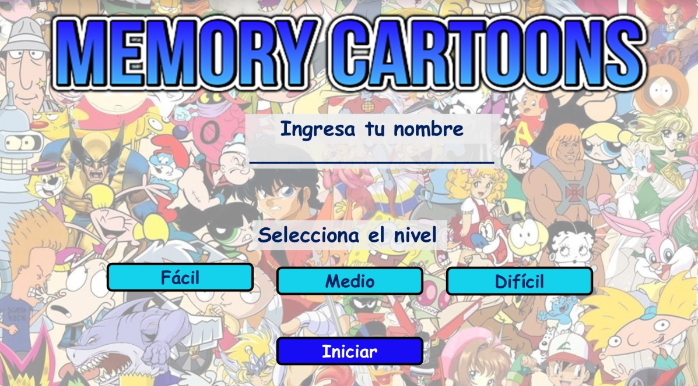
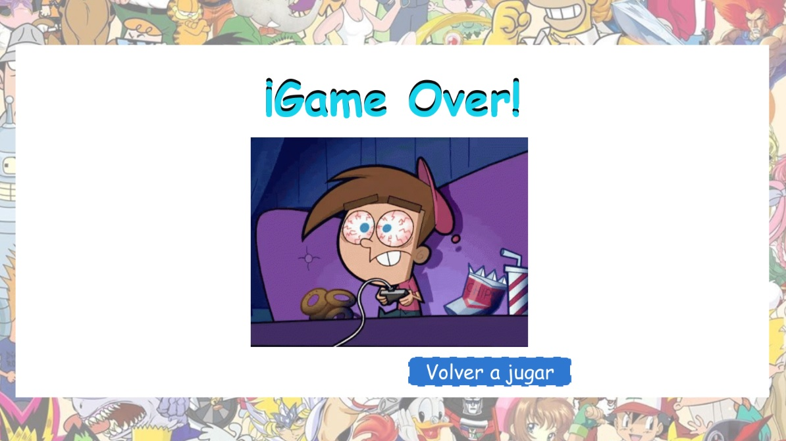
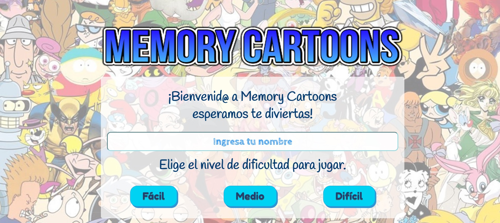
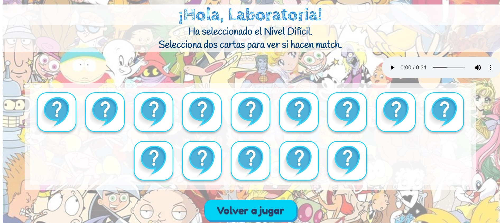
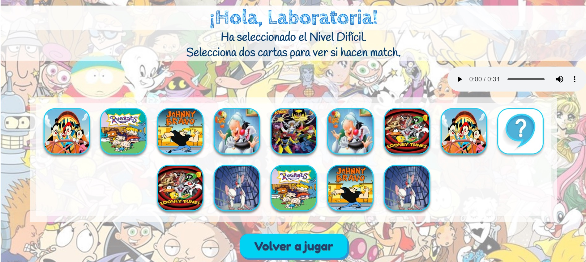
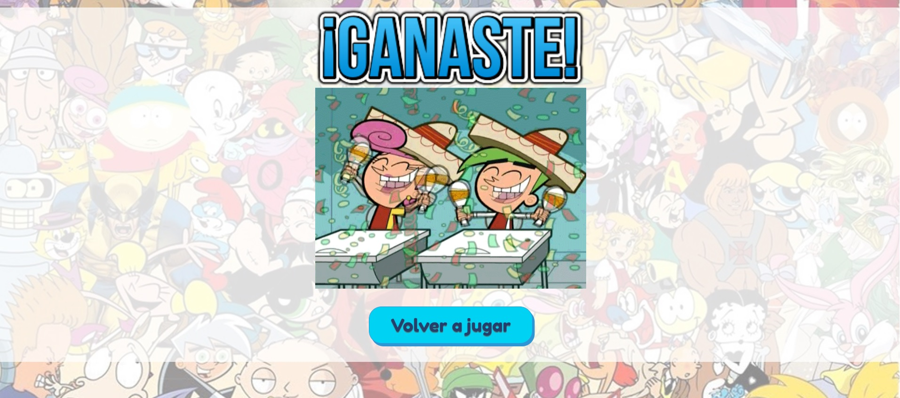

# Definición del producto

Memory Cartoon es un juego de memoria inspirado en los cartoons de los años 90 y consiste en encontrar pares de cartas, abriendo dos pares a la vez hasta encontrar los 7 pares de cartas. El juego está diseñado para un público joven y se juega individualmente en diferentes dispositivos electrónicos como computadoras portátiles o teléfonos móviles.

# Aqui puedes ver nuestro proyecto

https://bemm12.github.io/SCL021-memory-match/index.html
https://danielaramirezcanquiz.github.io/SCL021-memory-match/

# Historias de usuario

Las historias de usuario se generan a partir de potenciales usuarios. Es por eso que desarrollamos una encuesta en los Formularios de Google, destacándose para nuestros usuarios objetivo los siguientes items:
Tu principal motivo de jugar Memory-Match seria: diversión

¿Qué te gustaría visualizar en el Memory-Match? Pantalla de bienvenida, tablero .
Qué temática te gustaría más: Personajes de caricaturas

¿Qué efectos auditivos te gustaría? Música de fondo.

# Criterios de aceptación:

• Escoger 1 imagen para cada tarjeta según la temática Cartoons.
• Se despliegan 14 cartas barajadas en el tablero.
• Cada carta tiene un par en el tablero.

# Definición de terminado

• Importar las imágenes a la carpeta data
• Duplicar las imágenes
• Barajar las cartas creando una función shuffle

# Diseño de la Interfaz de Usuario

# Prototipo de baja fidelidad

# Prototipo de alta fidelidad en power point

# Versión Final Proyecto Memory Cartoons

# Test de usabilidad

Niño de 8años nos comenta:
Le pareció entretenida la temática del juego y la paleta de colores utilizados. Le gustó los efectos de sonidos presentes en el juego. No necesito leer las instrucciones para comenzar a jugar. Jugo en 4 oportunidades apareciendo las tarjetas en diferentes posiciones, lo que le pareció entretenido.
